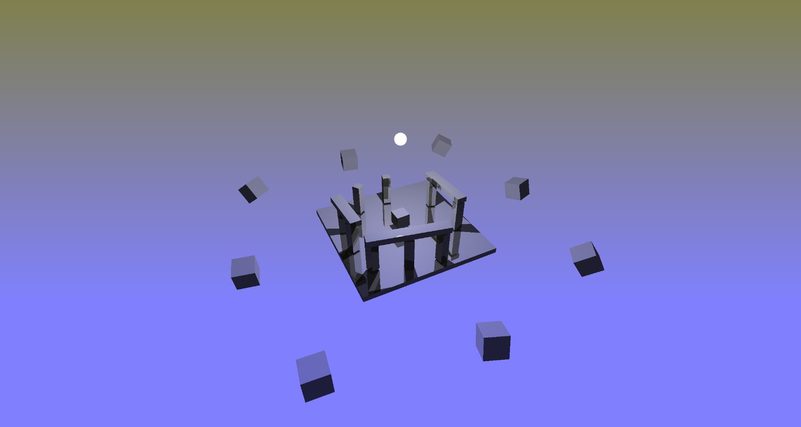
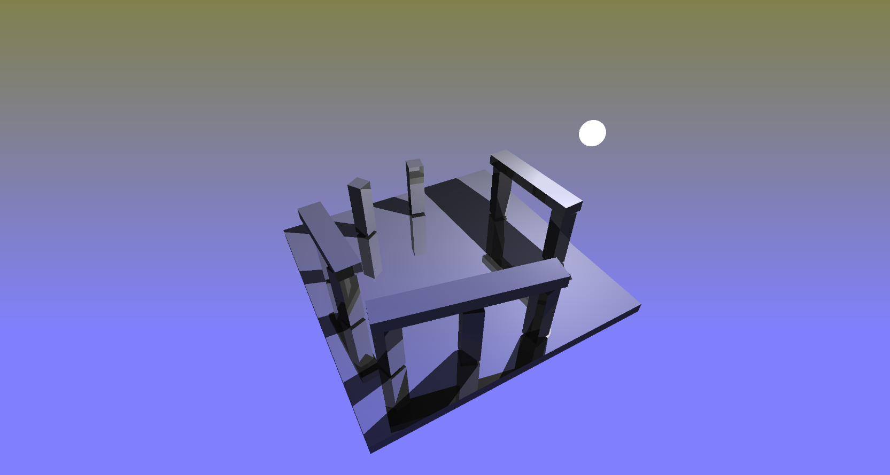
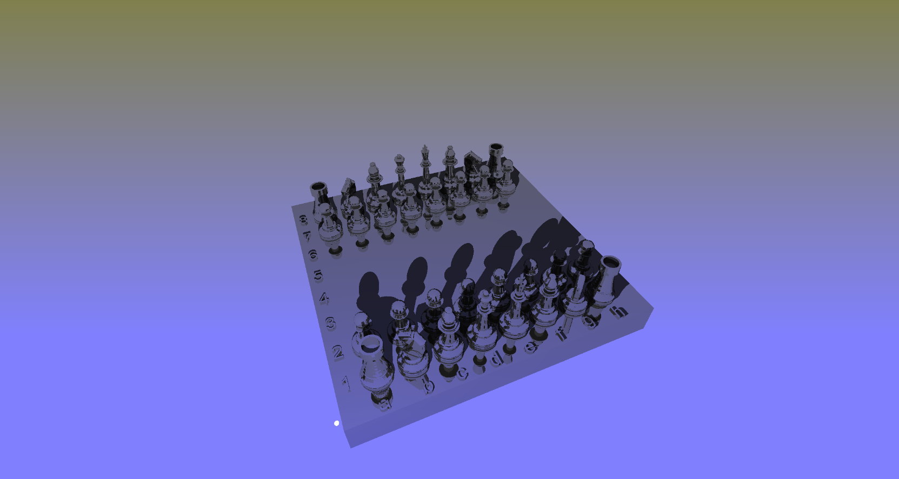

# WEBGPU LBVH RTRT demo

base webgpu LBVH builder forked from [here](https://github.com/AddisonPrairie/WebGPU-LVBH-demo)

and optimized by itmanager85 for real-time ray-tracing (with dynamic scenes)

scene 1

scene 2

scene 3

You can try the demo [here](https://itmanager85.github.io/webgpuRTRT-LBVH/) - just load scene by button (or just drag and drop an .obj model)
